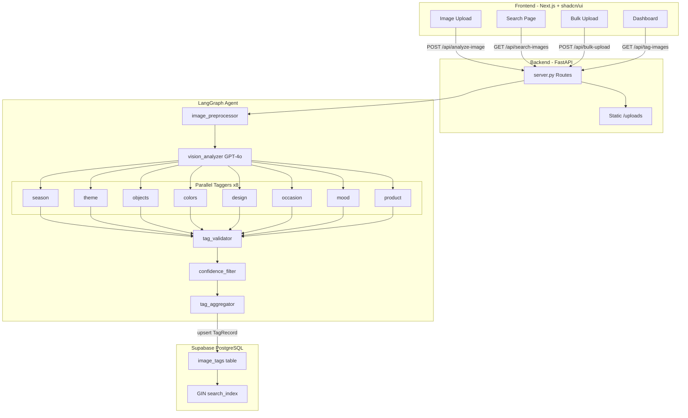

# Image Analysis Agent -- Phased Implementation Plan

## Key References

- **Spec document:** [image-tagging-agent-spec.md](image-tagging-agent-spec.md) -- contains all tag taxonomies (section 5), prompt templates (section 6), state schemas (section 3), node specs (section 4), and I/O contracts (section 8)
- **Project summary:** [PROJECT_SUMMARY_DETAILED.md](PROJECT_SUMMARY_DETAILED.md) -- contains architecture overview, API endpoint table, frontend component list, and data flow
- **Folder structure template:** [FOLDER_STRUCTURE.md](FOLDER_STRUCTURE.md) -- contains agent package layout rules
- **Environment variables:** [.env](.env) -- contains OPENAI_API_KEY, OPENAI_MODEL (gpt-4o), LANGCHAIN_API_KEY, DATABASE_URI (Supabase PostgreSQL)

## Final Project Structure

```
image-analysis-agent/
├── frontend/                    # Next.js App Router + shadcn/ui
│   ├── src/
│   │   ├── app/                 # App Router pages (layout, page, search/page)
│   │   ├── components/          # UI components (Navbar, ImageUploader, TagCards, etc.)
│   │   └── lib/                 # types, constants, API helpers
│   ├── package.json
│   ├── tailwind.config.ts
│   └── next.config.ts
│
├── backend/                     # Python FastAPI + LangGraph agent
│   ├── src/
│   │   ├── server.py            # FastAPI app, CORS, routes, static /uploads
│   │   ├── image_tagging/       # Agent package (per FOLDER_STRUCTURE.md)
│   │   │   ├── image_tagging.py # Compiled graph export
│   │   │   ├── graph_builder.py # Graph construction
│   │   │   ├── configuration.py # Runtime config (thresholds, models)
│   │   │   ├── settings.py      # Env vars loader
│   │   │   ├── taxonomy.py      # Single source of truth for all tag enums
│   │   │   ├── nodes/           # preprocessor, vision, taggers, validator, etc.
│   │   │   ├── prompts/         # System and tagger prompt templates
│   │   │   ├── schemas/         # State, TagResult, TagRecord, FlaggedTag
│   │   │   └── tools/           # Agent-specific tools
│   │   └── services/
│   │       └── supabase/        # DB client (upsert, search, list)
│   ├── requirements.txt
│   └── uploads/                 # Stored uploaded images
│
├── docs/                        # Full documentation tree (per rules)
│   ├── curriculum/
│   ├── quickstart/
│   ├── architecture/
│   ├── reports/
│   ├── errors/
│   └── plans/
│
├── tests/                       # Unit + integration tests
├── .env                         # API keys (already exists)
├── FOLDER_STRUCTURE.md
└── README.md
```

## Tech Stack

- **Frontend:** Next.js 15 (App Router), React 19, TypeScript, Tailwind CSS v4, shadcn/ui, Framer Motion, Lucide icons, react-dropzone
- **Backend:** Python 3.11+, FastAPI, LangGraph, langchain-openai (GPT-4o vision), Pillow, python-dotenv, httpx, pydantic
- **Database:** Supabase PostgreSQL via psycopg2, JSONB tag_record, GIN-indexed search_index array
- **Tracing:** LangSmith (optional, keys already in .env)

---

## Phase 0: Project Skeleton and Configuration

**Goal:** Get both servers starting with zero functionality, set up all folders and empty files, create docs tree.

### Step 0.1 -- Create backend folder structure

1. Create the folder `backend/` at the project root
2. Inside `backend/`, create `requirements.txt` with these exact packages (do NOT invent version numbers -- use latest): fastapi, uvicorn[standard], langchain-core, langchain-openai, langgraph, pillow, python-dotenv, httpx, pydantic, psycopg2-binary
3. Create the folder `backend/uploads/` (empty, for storing uploaded images later)
4. Create the folder tree inside `backend/src/`:
  - `backend/src/__init__.py` (empty)
  - `backend/src/image_tagging/__init__.py` (empty)
  - `backend/src/image_tagging/image_tagging.py` (empty placeholder)
  - `backend/src/image_tagging/graph_builder.py` (empty placeholder)
  - `backend/src/image_tagging/configuration.py` (empty placeholder)
  - `backend/src/image_tagging/taxonomy.py` (empty placeholder)
  - `backend/src/image_tagging/nodes/__init__.py` (empty)
  - `backend/src/image_tagging/prompts/__init__.py` (empty)
  - `backend/src/image_tagging/schemas/__init__.py` (empty)
  - `backend/src/image_tagging/tools/__init__.py` (empty)
  - `backend/src/services/__init__.py` (empty)
  - `backend/src/services/supabase/__init__.py` (empty)

### Step 0.2 -- Create backend settings loader

1. Create `backend/src/image_tagging/settings.py`
2. This file must use `python-dotenv` to load variables from the root `.env` file (path: `../../.env` relative to backend/src/)
3. It must expose these variables: OPENAI_API_KEY, OPENAI_MODEL (default "gpt-4o"), DATABASE_URI (optional), LANGCHAIN_API_KEY (optional), LANGCHAIN_TRACING_V2 (optional)
4. Use `os.getenv()` with sensible defaults. Raise an error if OPENAI_API_KEY is missing.

### Step 0.3 -- Create backend FastAPI server with health check

1. Create `backend/src/server.py`
2. Create a FastAPI app instance
3. Add CORS middleware allowing all origins (for local development)
4. Add one route: `GET /api/health` that returns `{"status": "healthy"}`
5. The server should be runnable via: `cd backend && uvicorn src.server:app --reload --host 0.0.0.0 --port 8000`

### Step 0.4 -- Create frontend with Next.js

1. Run `npx create-next-app@latest frontend` from the project root with these options: TypeScript=yes, Tailwind=yes, ESLint=yes, App Router=yes, src/ directory=yes
2. After creation, `cd frontend` and run `npx shadcn@latest init` -- choose defaults (New York style, Zinc color, CSS variables=yes)
3. Install additional packages: `npm install framer-motion lucide-react react-dropzone`
4. Add shadcn components that will be needed: `npx shadcn@latest add button card badge skeleton toast sonner`
5. Create `frontend/.env.local` with one variable: `NEXT_PUBLIC_API_URL=http://localhost:8000`

### Step 0.5 -- Create base frontend layout and Navbar

1. Edit `frontend/src/app/layout.tsx`:
  - Import a nice Google font (e.g., Inter or Geist)
  - Add a ThemeProvider for dark/light mode support (use next-themes -- install it: `npm install next-themes`)
  - Wrap the app in ThemeProvider
2. Create `frontend/src/components/Navbar.tsx`:
  - A sticky top navigation bar with the project name "Image Tagger" on the left
  - Two nav links: "Tag Image" (links to `/`) and "Search" (links to `/search`)
  - A dark/light mode toggle button on the right using a Sun/Moon icon from lucide-react
  - Styled with Tailwind -- use a glassmorphism or subtle blur background effect
3. Create `frontend/src/components/ThemeProvider.tsx` -- a wrapper around next-themes ThemeProvider
4. Create `frontend/src/components/ThemeToggle.tsx` -- button that toggles between dark and light mode
5. Edit `frontend/src/app/page.tsx` to just show a heading "Image Analysis Agent" centered on the page (placeholder)
6. Create `frontend/src/app/search/page.tsx` with a heading "Search" (placeholder)

### Step 0.6 -- Create docs folder tree

1. Create every folder and README.md file per the documentation-structure rule in `.cursor/rules/documentation-structure.mdc`. That means creating:
  - `docs/README.md` -- index of all subfolders
  - `docs/curriculum/README.md` -- says "Learning Curriculum" and lists no lessons yet
  - `docs/quickstart/README.md` -- says "Quickstart Guides" and lists no guides yet
  - `docs/architecture/README.md` -- says "Architecture Docs" and lists no docs yet
  - `docs/reports/README.md` -- says "Reports" and links to PROGRESS.md
  - `docs/errors/README.md` -- says "Error Log" and lists nothing yet
  - `docs/plans/README.md` -- says "Phase Plans" and lists nothing yet
2. Create `docs/reports/PROGRESS.md` with the initial mermaid progress diagram. Use the template from `.cursor/rules/progress-diagram.mdc`. All nodes should be marked `[ ]` (pending) at this point.

### Step 0.7 -- Create README.md files for every code folder

Per the folder-readme rule in `.cursor/rules/folder-readme.mdc`, create a `README.md` inside every folder that does not already have one. Each README must have a 1-2 sentence description and a Contents table listing the files inside. Folders to cover: `backend/`, `backend/src/`, `backend/src/image_tagging/`, `backend/src/image_tagging/nodes/`, `backend/src/image_tagging/prompts/`, `backend/src/image_tagging/schemas/`, `backend/src/image_tagging/tools/`, `backend/src/services/`, `backend/src/services/supabase/`, `frontend/src/components/`.

### Step 0.8 -- Verify and create phase-0-setup.md

1. Test: run `cd backend && pip install -r requirements.txt && uvicorn src.server:app --port 8000` -- verify `GET http://localhost:8000/api/health` returns 200
2. Test: run `cd frontend && npm install && npm run dev` -- verify the app opens at [http://localhost:3000](http://localhost:3000) with the Navbar visible
3. Create `docs/plans/phase-0-setup.md` per the phase-setup-guide rule in `.cursor/rules/phase-setup-guide.mdc`
4. Update `docs/reports/PROGRESS.md` -- mark Phase 0 tasks as `[done]`

---

## Phase 1: Simple Image Analyzer + React UI

**Goal:** Upload an image in the browser, send it to GPT-4o vision, display the AI's description and raw observations. No LangGraph yet -- just a direct OpenAI API call.

### Step 1.1 -- Backend: mount static files for uploads

1. In `backend/src/server.py`, mount the `uploads/` directory as static files at the URL path `/uploads` using FastAPI's `StaticFiles`
2. This means any file saved to `backend/uploads/foo.jpg` will be accessible at `http://localhost:8000/uploads/foo.jpg`

### Step 1.2 -- Backend: create POST /api/analyze-image endpoint

1. Add a new POST route at `/api/analyze-image` in `backend/src/server.py`
2. This endpoint accepts a single file upload (multipart form data) with the field name `file`
3. **Validation:** Check the file is an image (accept only JPEG, PNG, WEBP). If not, return 400 with an error message.
4. **Save file:** Generate a unique filename using uuid4 + original extension. Save the file to `backend/uploads/`. Build the full image URL as `http://localhost:8000/uploads/{filename}`.
5. **Read file as base64:** Read the saved file bytes and encode to base64 string.
6. **Call OpenAI GPT-4o vision:** Use the `langchain-openai` ChatOpenAI class. Create a message with two content parts: (a) a text part with the system prompt from spec section 6.1 (the "visual product analyst" prompt that asks for JSON with visual_description, dominant_mood, visible_subjects, color_observations, design_observations, seasonal_indicators, style_indicators, text_present), and (b) an image_url part with the base64 image as a data URI (`data:image/jpeg;base64,{base64_string}`).
7. **Parse response:** The LLM should return JSON. Parse it. If parsing fails, return the raw text as vision_description and empty dict as vision_raw_tags.
8. **Return response:** Return a JSON object with: `image_url` (the URL from step 4), `image_id` (the uuid), `vision_description` (the visual_description field from the LLM response), `vision_raw_tags` (the full parsed JSON object from the LLM).
9. **Error handling:** Wrap the OpenAI call in try/except. On timeout or API error, return 500 with error message.

### Step 1.3 -- Frontend: create ImageUploader component

1. Create `frontend/src/components/ImageUploader.tsx`
2. Use `react-dropzone` to create a drag-and-drop zone that accepts image files (JPG, PNG, WEBP)
3. **Visual design:** Large dashed border area with an Upload icon (from lucide-react) in the center. Text says "Drag & drop an image here, or click to browse". Use shadcn Card as the container.
4. When a file is selected, show a preview of the image inside the drop zone (replace the upload prompt)
5. Show the file name and size below the preview
6. Show an "Analyze" button (shadcn Button) that only appears after a file is selected
7. The component should accept an `onAnalyze` callback prop that receives the file object when the button is clicked
8. Add file size validation (max 10MB). Show an error message if exceeded.

### Step 1.4 -- Frontend: create ProcessingOverlay component

1. Create `frontend/src/components/ProcessingOverlay.tsx`
2. This is a full-screen semi-transparent overlay that appears while the backend is processing
3. Show a series of steps with animated transitions using Framer Motion:
  - Step 1: "Uploading image..." (with a spinner icon)
  - Step 2: "Analyzing with AI..." (with a brain/sparkle icon)
  - Step 3: "Complete!" (with a check icon)
4. Each step animates in with a fade-up effect
5. The component takes a `currentStep` number prop and `isVisible` boolean prop
6. Use a backdrop blur effect on the overlay background

### Step 1.5 -- Frontend: create VisionResults component

1. Create `frontend/src/components/VisionResults.tsx`
2. This component receives the API response and displays results in a two-column layout (on desktop, stacked on mobile)
3. **Left column:** The uploaded image displayed at a reasonable size (max 400px wide), with rounded corners and a subtle shadow
4. **Right column:** A shadcn Card containing:
  - A heading "AI Analysis"
  - The `vision_description` text in a styled paragraph
  - A section for each key observation from `vision_raw_tags`: dominant_mood, visible_subjects (as badges), color_observations, design_observations, seasonal_indicators, style_indicators, text_present
  - Each section has a small label and the value displayed nicely
5. Use Framer Motion to animate the results appearing (stagger children)

### Step 1.6 -- Frontend: create JsonViewer component

1. Create `frontend/src/components/JsonViewer.tsx`
2. A collapsible section (default collapsed) with a toggle button labeled "View Raw JSON"
3. When expanded, shows the full raw JSON response formatted and syntax-highlighted
4. Use a monospace font and a dark code-block background
5. Install and use `react-syntax-highlighter` for syntax highlighting, or simply use a pre/code block with Tailwind styling

### Step 1.7 -- Frontend: wire up the dashboard page

1. Edit `frontend/src/app/page.tsx` to be the main dashboard
2. **State management:** Use React useState for: selectedFile, isProcessing, currentStep, analysisResult, error
3. **Layout:** Center the content with max-width. Show heading "Image Analysis Agent" with a subtitle.
4. **Flow:**
  - Show ImageUploader at the top
  - When user clicks Analyze: set isProcessing=true, show ProcessingOverlay
  - Make a POST request to `${NEXT_PUBLIC_API_URL}/api/analyze-image` with the file in FormData
  - Update currentStep as the request progresses (1=uploading, 2=analyzing)
  - On success: set currentStep=3, wait 500ms, hide overlay, set analysisResult
  - On error: hide overlay, show error message
  - When analysisResult exists: show VisionResults and JsonViewer below the uploader
  - Add a "Analyze New Image" button that resets all state
5. Create `frontend/src/lib/constants.ts` with `API_BASE_URL` exported from the env variable
6. Create `frontend/src/lib/types.ts` with TypeScript interfaces for `AnalyzeImageResponse` matching the backend response shape: `{ image_url: string, image_id: string, vision_description: string, vision_raw_tags: Record<string, any> }`

### Step 1.8 -- Verify and create phase-1-setup.md

1. Test the full flow: start backend (port 8000), start frontend (port 3000), upload a test image, verify you see the AI analysis
2. Update `docs/reports/PROGRESS.md` -- mark Phase 1 backend and frontend tasks as `[done]`
3. Create `docs/plans/phase-1-setup.md` per the phase-setup-guide rule

---

## Phase 2: LangGraph Pipeline + Taxonomy + First Tagger

**Goal:** Replace the direct OpenAI call with a proper LangGraph StateGraph. Define the full taxonomy. Implement 3 nodes: preprocessor, vision_analyzer, and season_tagger.

### Step 2.1 -- Define state schemas

1. Create `backend/src/image_tagging/schemas/states.py`
2. Define `ImageTaggingState` as a TypedDict with these exact fields (refer to spec section 3 for the full definition):
  - `image_id`: str
  - `image_url`: str
  - `image_base64`: Optional[str]
  - `metadata`: dict
  - `vision_description`: str
  - `vision_raw_tags`: dict
  - `partial_tags`: Annotated[list, operator.add] -- this is a LangGraph reducer that merges lists from parallel nodes
  - `validated_tags`: dict
  - `flagged_tags`: list
  - `tag_record`: dict
  - `processing_status`: str
  - `error`: Optional[str]

### Step 2.2 -- Define data models

1. Create `backend/src/image_tagging/schemas/models.py`
2. Define Pydantic BaseModel classes (refer to spec section 3 for fields):
  - `TagResult` -- category (str), tags (list of str), confidence_scores (dict mapping str to float)
  - `ValidatedTag` -- value (str), confidence (float), parent (Optional[str])
  - `FlaggedTag` -- category (str), value (str), confidence (float), reason (str)
  - `HierarchicalTag` -- parent (str), child (str)
  - `TagRecord` -- image_id (str), season (list[str]), theme (list[str]), objects (list of HierarchicalTag), dominant_colors (list of HierarchicalTag), design_elements (list[str]), occasion (list[str]), mood (list[str]), product_type (Optional HierarchicalTag), needs_review (bool), processed_at (str)
3. Also define `TaggerOutput` as a Pydantic model for structured LLM output: tags (list[str]), confidence_scores (dict[str, float]), reasoning (str)

### Step 2.3 -- Define taxonomy

1. Create the full taxonomy in `backend/src/image_tagging/taxonomy.py`
2. Define a Python dictionary called `TAXONOMY` where each key is a category name and each value is the list of allowed tag values
3. Copy ALL values exactly from the spec:
  - `"season"`: all 19 values from spec section 5.1 (christmas, hanukkah, kwanzaa, new_years, valentines_day, st_patricks_day, easter, mothers_day, fathers_day, fourth_of_july, halloween, thanksgiving, diwali, eid, birthday, wedding_anniversary, baby_shower, graduation, all_occasion)
  - `"theme"`: all 18 values from spec section 5.2 (whimsical, traditional, modern, minimalist, elegant_luxury, rustic_farmhouse, vintage_retro, kawaii_cute, floral_botanical, tropical, religious, feminine, masculine, kids_juvenile, nature_organic, abstract, typographic, photorealistic)
  - `"objects"`: a nested dict from spec section 5.3 with parent categories as keys (characters, animals, plants_nature, food_drink, objects_items, places_architecture, symbols_icons) and each value being a list of child strings
  - `"dominant_colors"`: a nested dict from spec section 5.4 with color family keys (red_family, pink_family, orange_family, yellow_family, green_family, blue_family, purple_family, neutral_family, metallic_family) and each value being a list of shade strings
  - `"design_elements"`: all values from spec section 5.5 -- combine patterns, textures, layout, and typography into one flat list
  - `"occasion"`: all 8 values from spec section 5.6
  - `"mood"`: all 9 values from spec section 5.7
  - `"product_type"`: a nested dict from spec section 5.8 with parent keys (gift_bag, gift_card_envelope, gift_wrap, gift_box, accessory) and each value being a list of child strings
4. Also create a helper function `get_flat_values(category)` that returns a flat list of all allowed values for a category (for hierarchical ones, it returns all child values from all parents)

### Step 2.4 -- Create prompt templates

1. Create `backend/src/image_tagging/prompts/system.py`
  - Define a string constant `VISION_ANALYZER_PROMPT` containing the exact system prompt from spec section 6.1. This prompt asks the LLM to analyze a product image and return JSON with keys: visual_description, dominant_mood, visible_subjects, color_observations, design_observations, seasonal_indicators, style_indicators, text_present.
2. Create `backend/src/image_tagging/prompts/tagger.py`
  - Define a function `build_tagger_prompt(description, category, allowed_values, instructions)` that returns a formatted string using the template from spec section 6.2. The prompt tells the LLM to select tags from the allowed_values list based on the image description and return JSON with tags, confidence_scores, and reasoning.

### Step 2.5 -- Create preprocessor node

1. Create `backend/src/image_tagging/nodes/preprocessor.py`
2. Define an async function `preprocess_image(state: ImageTaggingState) -> dict`
3. This function should:
  - Read the image from `state["image_url"]` or `state["image_base64"]`
  - Validate the format is JPG, PNG, or WEBP (using Pillow to open the image)
  - Resize the image so the longest edge is max 1024px (using Pillow). Maintain aspect ratio.
  - Extract metadata: width, height, format, file size
  - Convert the (possibly resized) image to base64 string
  - Return a dict updating the state: `{"image_base64": base64_string, "metadata": metadata_dict}`
  - On error (corrupt/invalid image), return `{"error": "description", "processing_status": "failed"}`

### Step 2.6 -- Create vision analyzer node

1. Create `backend/src/image_tagging/nodes/vision.py`
2. Define an async function `analyze_image(state: ImageTaggingState) -> dict`
3. This function should:
  - If `state["error"]` is set, return immediately (skip processing)
  - Create a ChatOpenAI instance using settings (OPENAI_API_KEY, model=OPENAI_MODEL)
  - Build a message with the VISION_ANALYZER_PROMPT as system message and the image as a user message with image_url content part (use the base64 data URI: `data:image/{format};base64,{state["image_base64"]}`)
  - Call the LLM with `await llm.ainvoke(messages)`
  - Parse the response content as JSON
  - Return `{"vision_description": parsed["visual_description"], "vision_raw_tags": parsed}`
  - On error, return `{"error": "Vision analysis failed: ...", "processing_status": "failed"}`

### Step 2.7 -- Create season tagger node

1. Create `backend/src/image_tagging/nodes/taggers.py`
2. Define a generic async function `run_tagger(state, category, allowed_values, instructions)` that:
  - Creates a ChatOpenAI instance (can use a cheaper model if desired, but gpt-4o is fine for now)
  - Builds the tagger prompt using `build_tagger_prompt()` from the prompts module
  - Calls the LLM using `.with_structured_output(TaggerOutput)` for reliable JSON parsing
  - Returns a dict with `{"partial_tags": [{"category": category, "tags": result.tags, "confidence_scores": result.confidence_scores}]}`
3. Define `async def tag_season(state) -> dict` that calls `run_tagger` with category="season", allowed_values from TAXONOMY["season"], and instructions="Select ALL seasons/holidays that apply. An image can have multiple."

### Step 2.8 -- Build the LangGraph graph

1. Edit `backend/src/image_tagging/graph_builder.py`
2. Import StateGraph from langgraph.graph, import START and END
3. Import ImageTaggingState from schemas
4. Import the three node functions: preprocess_image, analyze_image, tag_season
5. Build a simple linear graph:
  - `builder = StateGraph(ImageTaggingState)`
  - Add nodes: "image_preprocessor" -> preprocess_image, "vision_analyzer" -> analyze_image, "season_tagger" -> tag_season
  - Add edges: START -> "image_preprocessor" -> "vision_analyzer" -> "season_tagger" -> END
  - Return `builder.compile()`
6. Edit `backend/src/image_tagging/image_tagging.py` to import build_graph from graph_builder and export `graph = build_graph()`

### Step 2.9 -- Update server to use the graph

1. Edit `backend/src/server.py`
2. Import the compiled graph from `src.image_tagging.image_tagging`
3. Change the `POST /api/analyze-image` endpoint to:
  - Still accept file upload, save to uploads, generate image_id
  - Build an initial state dict: `{"image_id": id, "image_url": url, "image_base64": base64, "metadata": {}, "vision_description": "", "vision_raw_tags": {}, "partial_tags": [], "validated_tags": {}, "flagged_tags": [], "tag_record": {}, "processing_status": "pending", "error": None}`
  - Call `result = await graph.ainvoke(initial_state)`
  - Return the result including vision_description, vision_raw_tags, partial_tags (the season tags), image_url, image_id
4. Add a new GET endpoint `GET /api/taxonomy` that returns the TAXONOMY dict as JSON

### Step 2.10 -- Frontend: display tags with confidence

1. Create `frontend/src/components/TagCategoryCard.tsx`
  - Receives props: categoryName (string), tags (array of {value, confidence})
  - Displays a shadcn Card with the category name as heading
  - Inside the card, render each tag as a Badge/chip component
  - Color the badge based on confidence: green (>=0.8), yellow (0.65-0.8), red (<0.65)
  - Show the confidence percentage on hover (tooltip or title attribute)
2. Create `frontend/src/components/ConfidenceRing.tsx`
  - A circular SVG progress ring that shows an overall confidence score (0-100%)
  - Use a gradient stroke color (green for high, yellow for medium, red for low)
  - Show the percentage number in the center of the ring
  - Animate the ring filling using Framer Motion
3. Update `frontend/src/app/page.tsx`:
  - After receiving analysis results, also display the TagCategoryCard for season tags
  - Parse the `partial_tags` from the response to extract season category tags
  - Show the ConfidenceRing with the average confidence across all returned tags
4. Update `frontend/src/lib/types.ts` to add `TagResult` and `TaxonomyResponse` interfaces

### Step 2.11 -- Verify and create phase-2-setup.md

1. Test: upload an image, verify the graph runs (check terminal logs for preprocessor -> vision -> season_tagger flow), verify season tags with confidence appear in the UI
2. Test: `GET /api/taxonomy` returns the full taxonomy
3. Update `docs/reports/PROGRESS.md`
4. Create `docs/plans/phase-2-setup.md`

---

## Phase 3: Full Parallel Tagging Pipeline

**Goal:** Fan out vision_analyzer to all 8 taggers in parallel using LangGraph Send API. Add validator, confidence filter, and aggregator nodes. Show all 8 categories in the UI.

### Step 3.1 -- Add all remaining tagger functions

1. Edit `backend/src/image_tagging/nodes/taggers.py`
2. Add 7 new tagger functions that all follow the same pattern as tag_season (they all call `run_tagger` with different category, allowed_values, and instructions):
  - `tag_theme(state)` -- category="theme", values from TAXONOMY["theme"], instructions="Select all aesthetic themes that apply"
  - `tag_objects(state)` -- category="objects", values from get_flat_values("objects"), instructions="Select all visible objects and subjects. For hierarchical categories, return the child values." IMPORTANT: for hierarchical categories, pass the flat list of child values as allowed_values
  - `tag_colors(state)` -- category="dominant_colors", values from get_flat_values("dominant_colors"), instructions="Select up to 5 dominant colors. Return the specific shade names."
  - `tag_design(state)` -- category="design_elements", values from TAXONOMY["design_elements"], instructions="Select all applicable patterns, textures, layout features, and typography"
  - `tag_occasion(state)` -- category="occasion", values from TAXONOMY["occasion"], instructions="Select all applicable occasions or use cases"
  - `tag_mood(state)` -- category="mood", values from TAXONOMY["mood"], instructions="Select all applicable moods or tones"
  - `tag_product(state)` -- category="product_type", values from get_flat_values("product_type"), instructions="Select the single most likely product type. Return the specific child value."
3. Create a constant list `ALL_TAGGERS` mapping tagger node names to their functions: `{"season_tagger": tag_season, "theme_tagger": tag_theme, ...}`

### Step 3.2 -- Create tag_validator node

1. Create `backend/src/image_tagging/nodes/validator.py`
2. Define `async def validate_tags(state: ImageTaggingState) -> dict`
3. This function should:
  - Loop through each item in `state["partial_tags"]`
  - For each item, get its category and check every tag value against the taxonomy
  - For flat categories: check if the tag value exists in `TAXONOMY[category]`
  - For hierarchical categories (objects, dominant_colors, product_type): check if the value exists as any child in the nested dict
  - Valid tags go into `validated_tags` dict (keyed by category)
  - Invalid tags go into `flagged_tags` list with reason="invalid_taxonomy_value"
  - Return `{"validated_tags": validated, "flagged_tags": flagged}`

### Step 3.3 -- Create confidence_filter node

1. Create `backend/src/image_tagging/nodes/confidence.py`
2. Define `async def filter_by_confidence(state: ImageTaggingState) -> dict`
3. Import configuration values: CONFIDENCE_THRESHOLD (default 0.65), CATEGORY_CONFIDENCE_OVERRIDES, NEEDS_REVIEW_THRESHOLD (default 3)
4. This function should:
  - Loop through `state["validated_tags"]` (dict of category -> list of tags with confidence)
  - For each tag, get the applicable threshold (check CATEGORY_CONFIDENCE_OVERRIDES first, fallback to CONFIDENCE_THRESHOLD)
  - Tags above threshold stay in validated_tags
  - Tags below threshold move to flagged_tags with reason="low_confidence"
  - If any single category has 3+ flagged tags, set needs_review=True
  - Return `{"validated_tags": filtered, "flagged_tags": state["flagged_tags"] + new_flagged}`

### Step 3.4 -- Create tag_aggregator node

1. Create `backend/src/image_tagging/nodes/aggregator.py`
2. Define `async def aggregate_tags(state: ImageTaggingState) -> dict`
3. This function should:
  - Build a `TagRecord` dict from `state["validated_tags"]`
  - For flat categories (season, theme, design_elements, occasion, mood): extract the list of tag value strings
  - For hierarchical categories (objects, dominant_colors): look up each child value's parent in the taxonomy and build `{"parent": parent, "child": child}` objects
  - For product_type: pick the highest-confidence value and build a single `{"parent": parent, "child": child}` (or None if no product tags)
  - Set `needs_review` based on whether any flagged_tags exist or confidence_filter set it
  - Set `processed_at` to current ISO timestamp
  - Determine `processing_status`: "complete" if no flags, "needs_review" if some flags, "failed" if error
  - Return `{"tag_record": record, "processing_status": status}`

### Step 3.5 -- Update graph to parallel fan-out

1. Edit `backend/src/image_tagging/graph_builder.py`
2. Add all 8 tagger nodes, plus validator, confidence_filter, and aggregator nodes to the graph
3. Define a `fan_out_to_taggers(state)` function that returns a list of `Send()` calls -- one for each tagger node. Each Send targets the tagger node name and passes the current state.
4. Wire the graph:
  - START -> image_preprocessor -> vision_analyzer
  - vision_analyzer -> conditional edge using fan_out_to_taggers (returns Send to all 8 tagger nodes)
  - All 8 tagger nodes -> tag_validator (add an edge from each tagger to tag_validator)
  - tag_validator -> confidence_filter -> tag_aggregator -> END
5. Recompile the graph

### Step 3.6 -- Create configuration module

1. Edit `backend/src/image_tagging/configuration.py`
2. Define these constants (values from spec section 7):
  - CONFIDENCE_THRESHOLD = 0.65
  - NEEDS_REVIEW_THRESHOLD = 3
  - MAX_COLORS = 5
  - MAX_OBJECTS = 10
  - VISION_MODEL = "gpt-4o" (or from settings)
  - TAGGER_MODEL = "gpt-4o" (or from settings)
  - CATEGORY_CONFIDENCE_OVERRIDES = {"product_type": 0.80, "season": 0.60}

### Step 3.7 -- Update server response format

1. Edit `backend/src/server.py`
2. The POST /api/analyze-image response should now include all fields:
  - image_id, image_url, vision_description, vision_raw_tags
  - tags_by_category: reorganize partial_tags into a dict keyed by category name, where each value is a list of {value, confidence} objects
  - tag_record: the full TagRecord from the aggregator
  - flagged_tags: list of flagged tags with category, value, confidence, reason
  - processing_status: "complete" or "needs_review" or "failed"

### Step 3.8 -- Frontend: show all 8 tag categories

1. Create `frontend/src/components/TagCategories.tsx`
  - Receives the tags_by_category dict from the API response
  - Renders a responsive grid (2 columns on mobile, 3 on tablet, 4 on desktop) of TagCategoryCard components
  - One card per category, using proper display names (e.g., "Season / Holiday", "Theme / Aesthetic", "Objects & Subjects", "Dominant Colors", "Design Elements", "Occasion", "Mood / Tone", "Product Type")
  - Each card shows its tags as colored chips with confidence
2. Create `frontend/src/components/TagChip.tsx`
  - A small badge/chip component for a single tag
  - Shows the tag name (formatted nicely: replace underscores with spaces, capitalize)
  - Background color varies by confidence: green gradient (>=0.85), blue (0.7-0.85), yellow (0.55-0.7), red (<0.55)
  - Shows confidence percentage on hover
3. Create `frontend/src/components/FlaggedTags.tsx`
  - A collapsible section showing tags that were flagged
  - Each flagged tag shows: category, value, confidence score, and reason (low_confidence or invalid_taxonomy_value)
  - Use a warning/alert style with amber/yellow theming
4. Update `frontend/src/components/ProcessingOverlay.tsx`
  - Update the steps to: "Uploading..." -> "Preprocessing..." -> "Analyzing with AI..." -> "Tagging 8 categories..." -> "Validating..." -> "Complete!"
5. Update `frontend/src/app/page.tsx`
  - After results load, show: VisionResults, then TagCategories grid, then ConfidenceRing, then FlaggedTags (if any), then JsonViewer
  - Update types to match the new response format

### Step 3.9 -- Verify and create phase-3-setup.md

1. Test: upload an image, verify all 8 tagger categories appear in the UI with tags and confidence scores
2. Test: verify flagged tags section appears when applicable
3. Test: verify the tag_record in the JSON viewer matches the format from spec section 8.2
4. Update `docs/reports/PROGRESS.md`
5. Create `docs/plans/phase-3-setup.md`

---

## Phase 4: Supabase Integration + Persistence

**Goal:** Save TagRecords to Supabase PostgreSQL. Show history of previously analyzed images. Retrieve individual records.

### Step 4.1 -- Create the database table

1. Create `backend/src/services/supabase/migration.sql` (not auto-run, just a reference file)
2. The SQL should CREATE TABLE `image_tags` with these columns:
  - `image_id` TEXT PRIMARY KEY
  - `tag_record` JSONB NOT NULL
  - `search_index` TEXT[] NOT NULL DEFAULT '{}'
  - `image_url` TEXT
  - `needs_review` BOOLEAN DEFAULT false
  - `processing_status` TEXT DEFAULT 'pending'
  - `created_at` TIMESTAMPTZ DEFAULT NOW()
  - `updated_at` TIMESTAMPTZ DEFAULT NOW()
3. Add a GIN index on search_index: `CREATE INDEX idx_search_index ON image_tags USING GIN (search_index)`
4. Add a GIN index on tag_record: `CREATE INDEX idx_tag_record ON image_tags USING GIN (tag_record)`
5. Run this SQL against the Supabase database manually or add an init function that runs it on first connection

### Step 4.2 -- Create Supabase client

1. Create `backend/src/services/supabase/settings.py`
  - Load DATABASE_URI from the root .env file
  - Define SUPABASE_ENABLED as True if DATABASE_URI is set and non-empty, False otherwise
2. Create `backend/src/services/supabase/client.py`
  - Create a `SupabaseClient` class that manages a psycopg2 connection pool using DATABASE_URI
  - Implement `build_search_index(tag_record: dict) -> list[str]`:
    - Flatten all tag values from every category into a single list of strings
    - For hierarchical tags (objects, colors, product_type), include BOTH parent and child values
    - Return the deduplicated list (this powers search)
  - Implement `upsert_tag_record(image_id, tag_record, image_url, needs_review, processing_status)`:
    - Build the search_index using build_search_index
    - INSERT into image_tags ON CONFLICT (image_id) DO UPDATE
  - Implement `get_tag_record(image_id) -> dict or None`:
    - SELECT * FROM image_tags WHERE image_id = $1
  - Implement `list_tag_images(limit=20, offset=0) -> list[dict]`:
    - SELECT * FROM image_tags ORDER BY created_at DESC LIMIT $1 OFFSET $2
  - Each method should handle connection errors gracefully and log them

### Step 4.3 -- Update server with persistence endpoints

1. Edit `backend/src/server.py`
2. Import the SupabaseClient and SUPABASE_ENABLED
3. Create a single SupabaseClient instance at module level (if SUPABASE_ENABLED)
4. Update `POST /api/analyze-image`:
  - After the graph returns a result, if SUPABASE_ENABLED, call `upsert_tag_record` with the result data
  - Add `saved_to_db: bool` to the response
5. Add `GET /api/tag-image/{image_id}`:
  - If not SUPABASE_ENABLED, return 503
  - Call `get_tag_record(image_id)` and return the result, or 404 if not found
6. Add `GET /api/tag-images`:
  - Accept query params `limit` (default 20) and `offset` (default 0)
  - If not SUPABASE_ENABLED, return 503
  - Call `list_tag_images(limit, offset)` and return the results

### Step 4.4 -- Frontend: add save functionality and toast

1. Install the sonner toast library if not already: it comes with shadcn/ui Toast component
2. Add a Toaster component to `frontend/src/app/layout.tsx` (shadcn Sonner)
3. Update `frontend/src/app/page.tsx`:
  - After analysis results are displayed, show a "Save to Database" button (if not already saved)
  - When clicked, the save happens automatically since analyze-image now saves
  - Show a success toast "Image tags saved successfully" or error toast on failure
  - If `saved_to_db` is true in the response, show a green "Saved" badge instead of the save button

### Step 4.5 -- Frontend: create HistoryGrid component

1. Create `frontend/src/components/HistoryGrid.tsx`
2. This component fetches recent tagged images from `GET /api/tag-images`
3. Display as a responsive grid of cards (3-4 columns)
4. Each card shows:
  - The image thumbnail (small, square crop or cover)
  - The image_id
  - The processing_status as a colored badge (green=complete, yellow=needs_review, red=failed)
  - 3-4 top tags from the tag_record (pick from season + theme for brevity)
  - The processed_at date formatted nicely
5. Cards should have hover effects (slight scale up, shadow increase)
6. The component should have a "Refresh" button and auto-fetch on mount
7. Add this component below the main analysis area on the dashboard page
8. Add a section heading "Recently Tagged Images" above it

### Step 4.6 -- Verify and create phase-4-setup.md

1. Test: upload and analyze an image, verify it appears in the database (check Supabase dashboard or use the /api/tag-image/{id} endpoint)
2. Test: verify the HistoryGrid shows previously tagged images
3. Test: verify the save toast appears
4. Update `docs/reports/PROGRESS.md`
5. Create `docs/plans/phase-4-setup.md`

---

## Phase 5: Search, Filters, and Bulk Upload

**Goal:** Build a search page with filtering by tag categories. Add bulk image upload support.

### Step 5.1 -- Add search queries to Supabase client

1. Edit `backend/src/services/supabase/client.py`
2. Add `search_images_filtered(filters: dict) -> list[dict]`:
  - `filters` is a dict where keys are category names and values are lists of selected tag values
  - Build a SQL query: SELECT * FROM image_tags WHERE search_index @> ARRAY[...values...]
  - The `@>` operator checks if the search_index array contains ALL the specified values (AND logic)
  - Order by created_at DESC, limit 50
3. Add `get_available_filter_values(filters: dict) -> dict`:
  - First run the filtered search to get matching rows
  - For each row, collect all unique values from each tag_record category
  - Return a dict keyed by category name, where each value is a sorted list of unique tag values that exist in the filtered result set
  - This powers "cascading filters" -- as you select more filters, the other dropdowns only show values that exist in the current results

### Step 5.2 -- Add search API endpoints

1. Edit `backend/src/server.py`
2. Add `GET /api/search-images`:
  - Accept query params for each category: season, theme, objects, dominant_colors, design_elements, occasion, mood, product_type. Each param can be a comma-separated list of values.
  - Parse the params into a filters dict
  - Call `search_images_filtered(filters)` and return the results
3. Add `GET /api/available-filters`:
  - Same query params as search-images
  - Call `get_available_filter_values(filters)` and return the result

### Step 5.3 -- Add bulk upload endpoint

1. Edit `backend/src/server.py`
2. Add `POST /api/bulk-upload`:
  - Accept multiple files in the multipart form data
  - Generate a batch_id (uuid4)
  - Store the batch state in a module-level dict: `{batch_id: {total: N, completed: 0, results: [], status: "processing"}}`
  - Process each file sequentially (or using asyncio.gather for parallelism): save file, build initial state, run graph, save to DB, update batch progress
  - Return immediately with `{batch_id: id, total: N, status: "processing"}`
3. Add `GET /api/bulk-status/{batch_id}`:
  - Return the batch state: total, completed, results (list of {image_id, status}), overall status

### Step 5.4 -- Frontend: create search page

1. Edit `frontend/src/app/search/page.tsx`
2. Layout: sidebar on the left (filter panel) + main content area on the right
3. On mobile, the sidebar should be collapsible (hamburger toggle)

### Step 5.5 -- Frontend: create FilterSidebar component

**IMPORTANT -- Use the reference image at `assets/c__Users_Nagdy_AppData_Roaming_Cursor_User_workspaceStorage_acad3deff119f9ed4d35d3371876f2e1_images_image-b384b571-b68b-43d3-b645-39d7a3252875.png` as the design target for this component. The filter UI uses clickable tag chips, NOT checkboxes.**

1. Create `frontend/src/components/FilterSidebar.tsx`
2. On mount, fetch the full taxonomy from `GET /api/taxonomy`
3. **Heading:** Show "Filter by Tags" as the main heading at the top of the sidebar
4. **Selection status:** Below the heading, show either "No filters selected" (gray text) when nothing is selected, or a row of selected filter chips (each with an "x" to remove) plus a "Clear All" button
5. **Category sections:** Render one collapsible card per category (8 total). Each category card must have:
  - A **colored left border accent** that is unique per category. Assign a distinct color to each:
    - Season: gold/amber
    - Theme: purple/violet
    - Objects: teal/cyan
    - Dominant Colors: pink/rose
    - Design Elements: blue
    - Occasion: green/emerald
    - Mood: orange
    - Product Type: indigo
  - A **header row** with the category display name on the left and a chevron (^/v) toggle icon on the right to expand/collapse
  - When expanded, the card body shows **all tag values as rounded pill/chip buttons** laid out in a **flex-wrap flow layout** (not a list, not checkboxes)
6. **Chip button design:**
  - Default (unselected): dark background (matching the page bg), subtle border matching the category accent color, light text. Ghost/outline style.
  - Selected: filled background using the category accent color, white text. Visually "active/pressed" look.
  - Chips should have rounded-full corners (pill shape), horizontal padding, consistent height
  - Tag text should be formatted nicely: replace underscores with spaces, title case (e.g., "valentines_day" becomes "Valentines Day")
  - Clicking a chip toggles it between selected and unselected
7. **Hierarchical categories** (Objects, Dominant Colors, Product Type) need special treatment:
  - Group child values under their parent with an **uppercase sub-header label** (e.g., "CHARACTERS", "ANIMALS", "RED_FAMILY")
  - The parent name itself should also appear as a chip, but styled slightly differently (bold text or brighter border) to indicate it is a parent-level filter
  - Child chips appear below the parent sub-header in the same flex-wrap flow
  - Each parent group has some vertical spacing separating it from the next
8. **Filter behavior:** When any chip is toggled:
  - Update the local selected filters state
  - Call `GET /api/available-filters` with the current selections to get cascading options
  - Gray-out/dim chips that are not available in the cascaded results (reduce opacity, no pointer cursor)
  - Call `GET /api/search-images` with the current selections to update the results grid

### Step 5.6 -- Frontend: create SearchResults and DetailModal

1. Create `frontend/src/components/SearchResults.tsx`
  - Receives an array of search results
  - Renders a responsive grid of image cards (similar to HistoryGrid but more detailed)
  - Each card shows: image, season tags, theme tags, processing status
  - Show a "No results found" empty state with an illustration when the array is empty
  - Show loading skeletons while fetching
2. Create `frontend/src/components/DetailModal.tsx`
  - A modal/dialog (shadcn Dialog) that opens when clicking a search result card
  - Shows the full image at a large size
  - Shows the complete TagRecord organized by category (reuse TagCategories component)
  - Shows flagged tags if any
  - Shows metadata (processed_at, processing_status)
  - Has a close button and closes on backdrop click

### Step 5.7 -- Frontend: create BulkUploader component

1. Create `frontend/src/components/BulkUploader.tsx`
2. A multi-file drop zone (react-dropzone with multiple=true)
3. Shows a list of selected files with thumbnails
4. "Start Bulk Analysis" button that:
  - POSTs all files to `/api/bulk-upload`
  - Gets back a batch_id
  - Polls `GET /api/bulk-status/{batch_id}` every 2 seconds
  - Shows a progress bar (completed / total)
  - Shows per-file status indicators (pending, processing, complete, failed)
5. On completion, show a summary and a button to view results in the history grid
6. Add this component to the dashboard page, below the single uploader, in a separate section titled "Bulk Upload"

### Step 5.8 -- Verify and create phase-5-setup.md

1. Test: go to /search, select some filters, verify results appear and cascading works
2. Test: click a search result, verify the detail modal shows full tag info
3. Test: bulk upload 3-5 images, verify progress tracking works and all images appear in history
4. Update `docs/reports/PROGRESS.md`
5. Create `docs/plans/phase-5-setup.md`

---

## Phase 6: Polish, Docker, and Documentation

**Goal:** Production readiness, Docker deployment, and comprehensive documentation.

### Step 6.1 -- Docker setup

1. Create `backend/Dockerfile`:
  - Use python:3.11-slim base image
  - Copy requirements.txt and install dependencies
  - Copy src/ folder
  - Create uploads/ directory
  - Expose port 8000
  - CMD: uvicorn src.server:app --host 0.0.0.0 --port 8000
2. Create `frontend/Dockerfile`:
  - Use node:20-alpine base image
  - Multi-stage build: build stage (npm install + npm run build) and run stage (copy .next, run npm start)
  - Expose port 3000
3. Create `docker-compose.yml` at project root:
  - Service "backend": build from backend/, expose 8000, env_file .env, volume mount uploads/
  - Service "frontend": build from frontend/, expose 3000, depends_on backend, environment NEXT_PUBLIC_API_URL=[http://backend:8000](http://backend:8000)
4. Create `.dockerignore` files in both backend/ and frontend/

### Step 6.2 -- Error handling hardening

1. In `backend/src/server.py`, add a global exception handler that catches unhandled errors and returns a structured JSON error response
2. In the vision and tagger nodes, add retry logic: retry up to 2 times with exponential backoff (1s, 2s) on OpenAI API errors or timeouts
3. In the Supabase client, add connection retry logic and graceful handling of database downtime (the app should still work for analysis even if DB is down, just skip saving)

### Step 6.3 -- UI polish

1. Add loading Skeleton components (shadcn Skeleton) wherever data is being fetched (HistoryGrid, SearchResults, taxonomy loading)
2. Add proper empty states with illustrations or icons for: no history yet, no search results, no tags found
3. Add error boundaries around main sections so a component crash does not take down the whole page
4. Ensure all interactive elements have proper focus states and keyboard navigation (accessibility)
5. Add smooth page transitions using Framer Motion AnimatePresence on route changes
6. Test responsive layout on mobile, tablet, and desktop breakpoints

### Step 6.4 -- Write documentation

1. Create `docs/quickstart/SETUP.md` -- step-by-step: clone, install deps (backend pip install, frontend npm install), configure .env, run locally
2. Create `docs/quickstart/DOCKER_SETUP.md` -- docker-compose up instructions, env configuration, logs, troubleshooting
3. Create `docs/architecture/OVERVIEW.md` -- system architecture with mermaid diagram (frontend -> backend -> agent -> DB), tech stack rationale
4. Create `docs/architecture/GRAPH_NODES.md` -- describe each LangGraph node: purpose, inputs, outputs (per spec section 4)
5. Create `docs/architecture/TAXONOMY.md` -- full tag enum reference (all 8 categories, link to spec section 5)
6. Create `docs/architecture/DATABASE.md` -- Supabase schema, table, indexes, example queries
7. Create `docs/architecture/API.md` -- all FastAPI endpoints with request/response examples
8. Create `docs/architecture/FRONTEND.md` -- component tree, page structure, key components
9. Create `docs/architecture/PROMPTS.md` -- vision and tagger prompt templates, tuning tips
10. Create `docs/reports/PROJECT_SUMMARY.md` -- executive summary for manager audience
11. Create `docs/reports/FEATURES.md` -- feature checklist with status (done/planned)
12. Create `docs/reports/DECISIONS.md` -- key technical decisions (why LangGraph, why GPT-4o, why Supabase, etc.)
13. Create curriculum docs under `docs/curriculum/` (6 lessons per curriculum-learning rule):
  - 01-project-overview.md
    - 02-langgraph-basics.md
    - 03-state-and-nodes.md
    - 04-vision-and-taggers.md
    - 05-database-and-search.md
    - 06-frontend-and-api.md
14. Create `CHANGELOG.md` at project root listing all phases and what was built
15. Update the root `README.md` with project overview, features, quick start link, architecture diagram

### Step 6.5 -- Final verification and phase-6-setup.md

1. Test: docker-compose up builds and runs both services successfully
2. Test: full end-to-end flow works in Docker (upload, analyze, save, search)
3. Update `docs/reports/PROGRESS.md` -- all tasks marked `[done]`
4. Create `docs/plans/phase-6-setup.md`
5. Update all folder README.md files to reflect final file contents

---

## Architecture Diagram




