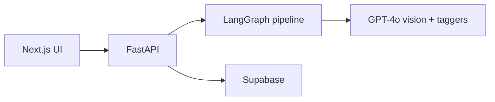

# Image Analysis Agent

AI-powered image tagging: upload product images, get structured tags (season, theme, colors, objects, etc.) via **LangGraph** and **OpenAI GPT-4o**, optionally store in **Supabase**, and search in the UI. Supports single and bulk upload with progress tracking.

## Features

- **Single image:** Upload → vision analysis → 8 category taggers (season, theme, objects, dominant colors, design elements, occasion, mood, product type) → validation and confidence filter → tag record and optional DB save.
- **Bulk upload:** Multiple images, background processing, progress bar and per-file status.
- **Search:** Filter by tags (cascading filters), grid results, detail modal with full tag record.
- **History:** Recently tagged images grid with refresh.

## Run with Docker

From the repo root:

```bash
docker compose up --build
```

- **App:** http://localhost:3000  
- **API:** http://localhost:8000  

Set `OPENAI_API_KEY` (and optionally `DATABASE_URI` for Supabase) in a `.env` file at the project root. See [docs/quickstart/DOCKER_SETUP.md](docs/quickstart/DOCKER_SETUP.md) for full Docker instructions and env vars.

## Architecture (high level)



- **Stack:** Next.js 16, React 19, Tailwind, shadcn/ui | FastAPI, LangGraph, langchain-openai | Supabase (PostgreSQL).
- **Docs:** [Quickstart](docs/quickstart/README.md) · [Architecture](docs/architecture/README.md) · [Phase plans](docs/plans/README.md) · [Curriculum](docs/curriculum/README.md) · [Changelog](CHANGELOG.md)
