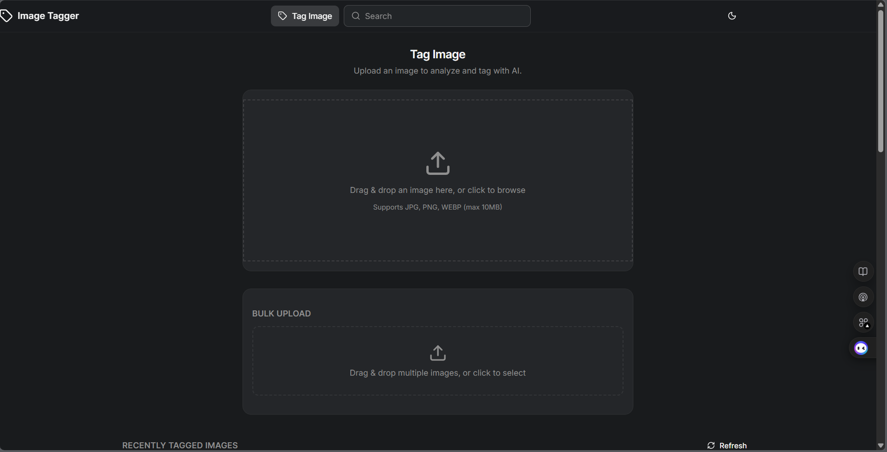
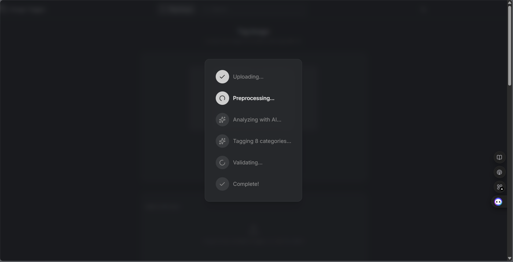
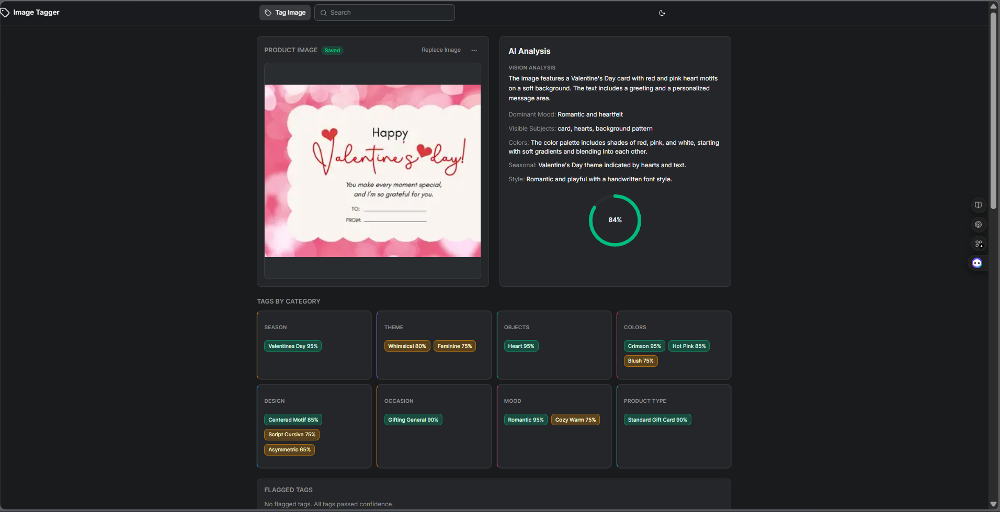
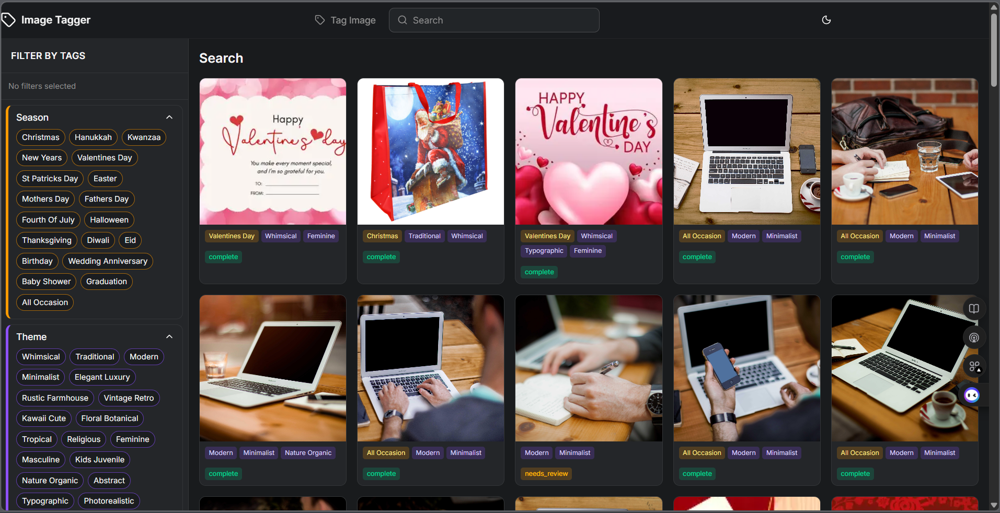
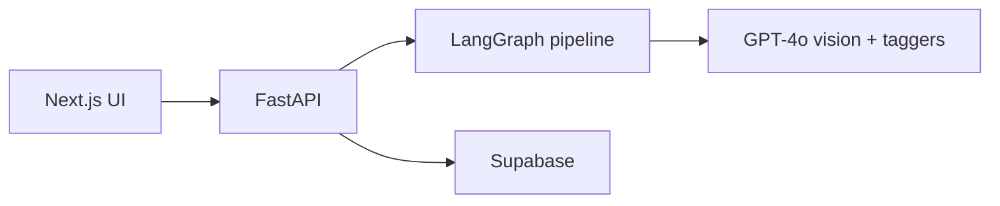
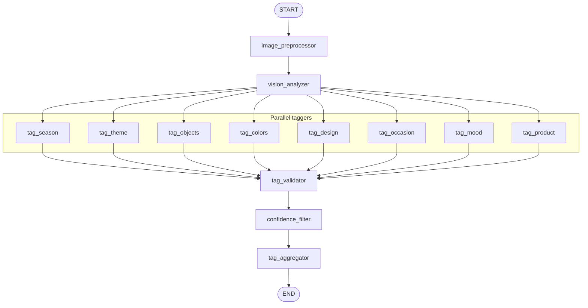

# Image Analysis Agent

AI-powered image tagging for product imagery. Upload images, get structured tags (season, theme, colors, objects, and more) via **LangGraph** and **OpenAI GPT-4o**, store results in **Supabase**, and search or browse them in a modern web UI.

---

## Features

| Feature | Description |
|--------|--------------|
| **Single image analysis** | Upload one image → vision analysis → 8 category taggers (season, theme, objects, dominant colors, design elements, occasion, mood, product type) → validation and confidence scoring → tag record with optional DB save. |
| **Bulk upload** | Process multiple images in the background with a progress bar and per-file status. |
| **Search** | Filter by tags with cascading filters, view results in a grid, and open a detail modal with the full tag record. |
| **History** | Browse recently tagged images and refresh the list on demand. |

---

## Screenshots

1. **Home — before upload**

   

2. **Analyzing**

   

3. **Analysis result**

   

4. **Search page**

   

---

## Quick start

**Prerequisites:** Docker and Docker Compose. For local runs: Python 3.11+, Node.js 20+.

From the repository root:

```bash
docker compose up --build
```

| Service | URL |
|--------|-----|
| **App** | http://localhost:3000 |
| **API** | http://localhost:8000 |

Create a `.env` file at the project root with:

- `OPENAI_API_KEY` — required for analysis.
- `DATABASE_URI` — optional; enables persistence and search (Supabase/PostgreSQL).

See [Docker setup](docs/quickstart/DOCKER_SETUP.md) and [local setup](docs/quickstart/SETUP.md) for details.

---

## Architecture

**High-level:**



**Agent pipeline (LangGraph):** preprocessor → vision → 8 parallel taggers → validator → confidence filter → aggregator → END.



**Stack:** Next.js 16 · React 19 · TypeScript · Tailwind CSS · shadcn/ui · FastAPI · LangGraph · langchain-openai · Supabase (PostgreSQL).  
Full pipeline description: [GRAPH_STRUCTURE.md](docs/architecture/GRAPH_STRUCTURE.md).

---

## Documentation

| Section | Description |
|--------|-------------|
| [**documentation/**](documentation/README.md) | Exhaustive reference: 20 numbered docs (agent state, nodes, taxonomy, API, DB, frontend, Docker, phases). |
| [Quickstart](docs/quickstart/README.md) | Get running with Docker or locally. |
| [Architecture](docs/architecture/README.md) | System design, graph structure, API, database, frontend. |
| [Phase plans](docs/plans/README.md) | Implementation guides for each phase. |
| [Curriculum](docs/curriculum/README.md) | Learning path for new engineers. |
| [Changelog](CHANGELOG.md) | Summary of phases and features. |

---

## Repository structure

```
image-analysis-agent/
├── backend/                      # FastAPI + LangGraph agent
│   ├── src/
│   │   ├── server.py              # FastAPI app, routes, static /uploads
│   │   ├── image_tagging/         # LangGraph agent package
│   │   │   ├── image_tagging.py   # Compiled graph export
│   │   │   ├── graph_builder.py   # Graph nodes and edges
│   │   │   ├── taxonomy.py        # Tag categories and allowed values
│   │   │   ├── configuration.py  # Thresholds, overrides
│   │   │   ├── settings.py        # Env vars (OpenAI, etc.)
│   │   │   ├── nodes/             # Graph nodes
│   │   │   │   ├── preprocessor.py
│   │   │   │   ├── vision.py
│   │   │   │   ├── taggers.py     # 8 category taggers
│   │   │   │   ├── validator.py
│   │   │   │   ├── confidence.py
│   │   │   │   └── aggregator.py
│   │   │   ├── prompts/           # System and tagger prompts
│   │   │   ├── schemas/           # State and data models
│   │   │   └── tools/             # Agent tools (placeholder)
│   │   └── services/
│   │       └── supabase/          # DB client, migration, settings
│   ├── uploads/                   # Stored images (created at runtime)
│   ├── requirements.txt
│   ├── Dockerfile
│   └── .dockerignore
│
├── frontend/                      # Next.js dashboard
│   ├── src/
│   │   ├── app/
│   │   │   ├── page.tsx           # Home: upload, result, history, bulk
│   │   │   ├── search/page.tsx    # Search page
│   │   │   ├── layout.tsx
│   │   │   ├── error.tsx
│   │   │   └── globals.css
│   │   ├── components/            # UI components
│   │   │   ├── ImageUploader.tsx
│   │   │   ├── BulkUploader.tsx
│   │   │   ├── DashboardResult.tsx
│   │   │   ├── FilterSidebar.tsx
│   │   │   ├── SearchResults.tsx
│   │   │   ├── DetailModal.tsx
│   │   │   ├── HistoryGrid.tsx
│   │   │   ├── TagCategories.tsx
│   │   │   ├── FlaggedTags.tsx
│   │   │   └── ui/               # shadcn (button, card, skeleton, etc.)
│   │   └── lib/                   # types, constants, formatTag, utils
│   ├── public/
│   ├── package.json
│   ├── Dockerfile
│   └── .dockerignore
│
├── documentation/                 # Exhaustive reference (20 numbered .md files)
│   ├── README.md                  # Contents table + links to 01–20
│   ├── 01-project-overview.md
│   ├── 02-architecture.md … 20-development-phases.md
│   └── …
│
├── docs/
│   ├── quickstart/                # SETUP.md, DOCKER_SETUP.md
│   ├── architecture/              # OVERVIEW, GRAPH_STRUCTURE, API, DB, etc.
│   ├── plans/                     # phase-0-setup.md … phase-6-setup.md
│   ├── curriculum/                # 01–06 lessons + README
│   ├── reports/                   # PROGRESS, PROJECT_SUMMARY, FEATURES, DECISIONS
│   └── errors/                    # Error log
│
├── docker-compose.yml
├── .env                            # OPENAI_API_KEY, DATABASE_URI (create as needed)
├── CHANGELOG.md
├── FOLDER_STRUCTURE.md             # LangGraph layout conventions
└── README.md
```

For layout conventions and design principles, see [FOLDER_STRUCTURE.md](FOLDER_STRUCTURE.md). For system design, see the [architecture overview](docs/architecture/OVERVIEW.md).
