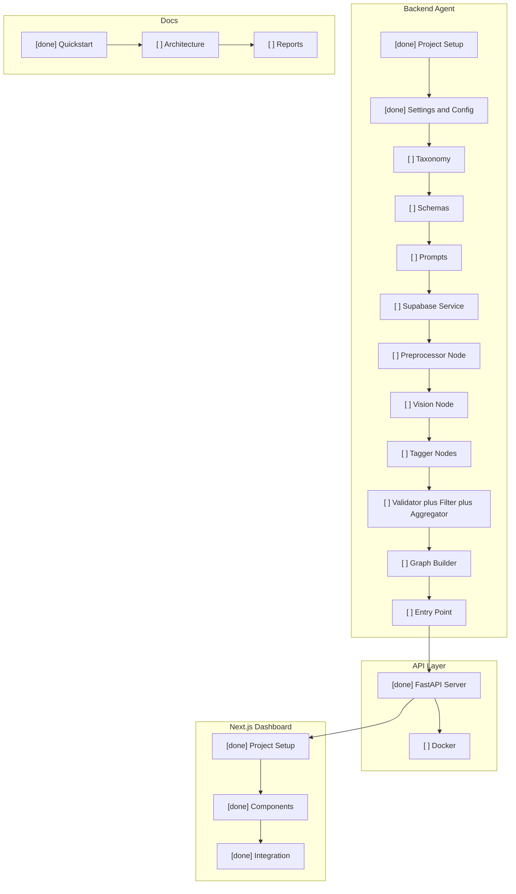

# Implementation Progress

```mermaid
flowchart TD
    subgraph Backend ["Backend Agent"]
        A["[done] Project Setup"]
        B["[done] Settings and Config"]
        C["[ ] Taxonomy"]
        D["[ ] Schemas"]
        E["[ ] Prompts"]
        F["[ ] Supabase Service"]
        G["[ ] Preprocessor Node"]
        H["[ ] Vision Node"]
        I["[ ] Tagger Nodes"]
        J["[ ] Validator plus Filter plus Aggregator"]
        K["[ ] Graph Builder"]
        L["[ ] Entry Point"]
        A --> B --> C --> D --> E --> F --> G --> H --> I --> J --> K --> L
    end

    subgraph API ["API Layer"]
        M["[done] FastAPI Server"]
        N["[ ] Docker"]
        L --> M --> N
    end

    subgraph Frontend ["Next.js Dashboard"]
        O["[done] Project Setup"]
        P["[done] Components"]
        Q["[done] Integration"]
        M --> O --> P --> Q
    end

    subgraph Documentation ["Docs"]
        R["[done] Quickstart"]
        S["[ ] Architecture"]
        T["[ ] Reports"]
        R --> S --> T
    end
```

**Last updated:** 2025-03-17  
**Currently working on:** Phase 1 complete; Phase 2 next
